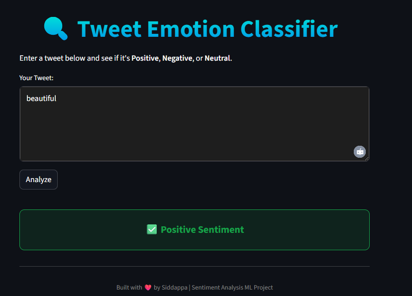

Tweet Sentiment Analysis

A simple and stylish machine learning web app built with Streamlit to classify the sentiment of tweets as Positive, Negative, or Neutral.

🚀 Live Demo

👉 Try the App Here

🌟 Features

🔍 Single tweet sentiment prediction

🌈 Dark-mode UI with gradient title & sentiment boxes

🧠 ML model trained with TF-IDF + Logistic Regression

🧽 Tweet preprocessing & cleaning (stopwords removal, lowercasing, etc.)

⚙️ How It Works

Clean the tweet → remove stopwords, special characters, and lowercase text

Transform text → apply trained TF-IDF Vectorizer

Predict sentiment → use Logistic Regression model

Display result → show color-coded sentiment box in the UI

🛠️ Tech Stack

🐍 Python

🎈 Streamlit

🤖 Scikit-learn

📦 Joblib

🧹 NLTK (text preprocessing)

📦 Installation
1️⃣ Clone the repository
git clone https://github.com/Siddappag/tweet-sentiment-analysis.git
cd tweet-sentiment-analysis

2️⃣ Create a virtual environment (recommended)
python -m venv venv
venv\Scripts\activate   # On Windows
source venv/bin/activate   # On Mac/Linux

3️⃣ Install dependencies
pip install -r requirements.txt

4️⃣ Download NLTK stopwords (only first time)
import nltk
nltk.download('stopwords')

5️⃣ Run the app
streamlit run app.py

👉 Open your browser at http://localhost:8501

📂 Project Structure
├── app.py                # Main Streamlit app
├── sentiment_model.pkl   # Trained ML model
├── vectorizer.pkl        # TF-IDF vectorizer
├── tweet_cleaner.py      # Preprocessing logic
├── requirements.txt      # Dependencies
└── README.md             # Project documentation

📸 App UI

  
